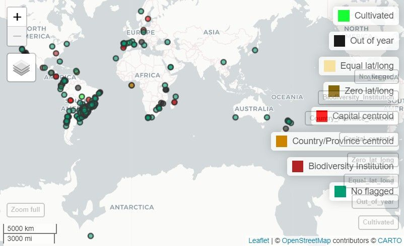
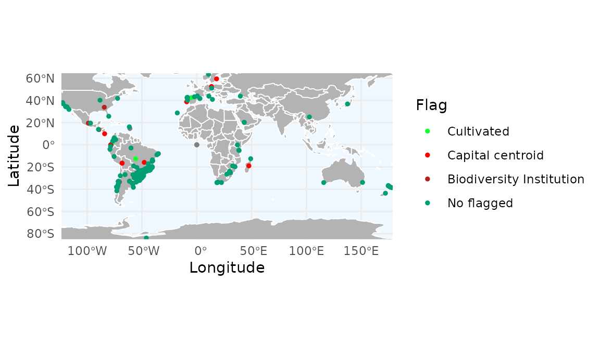
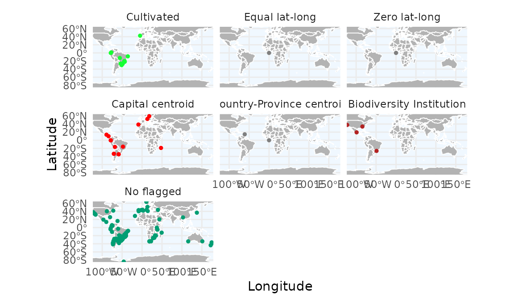
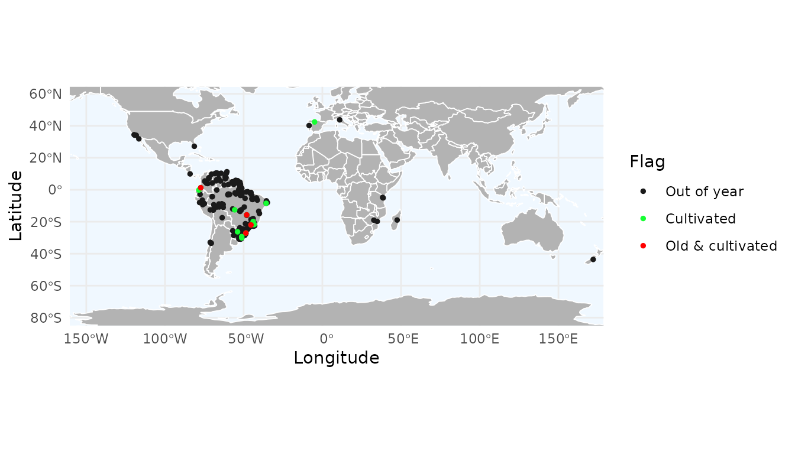
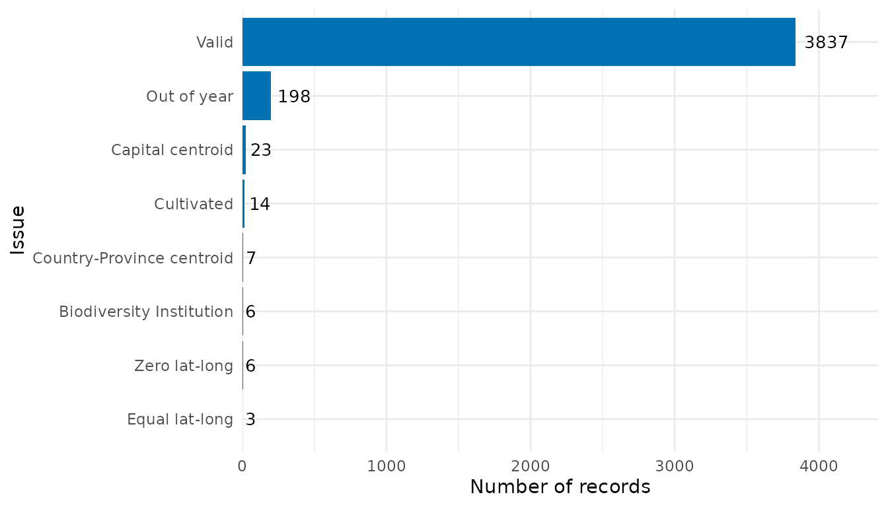
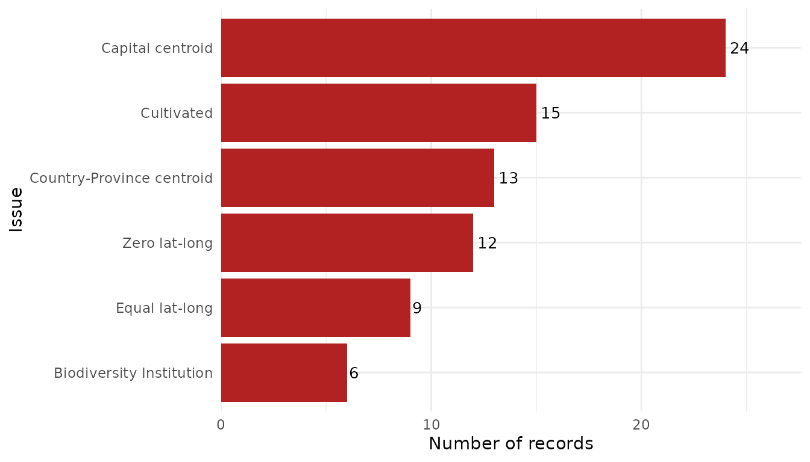
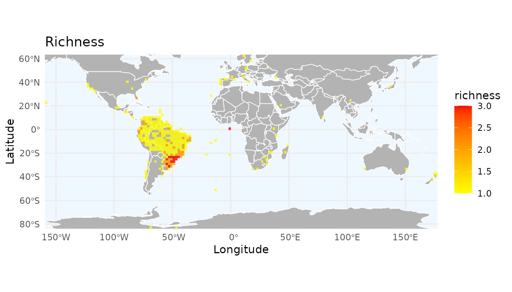
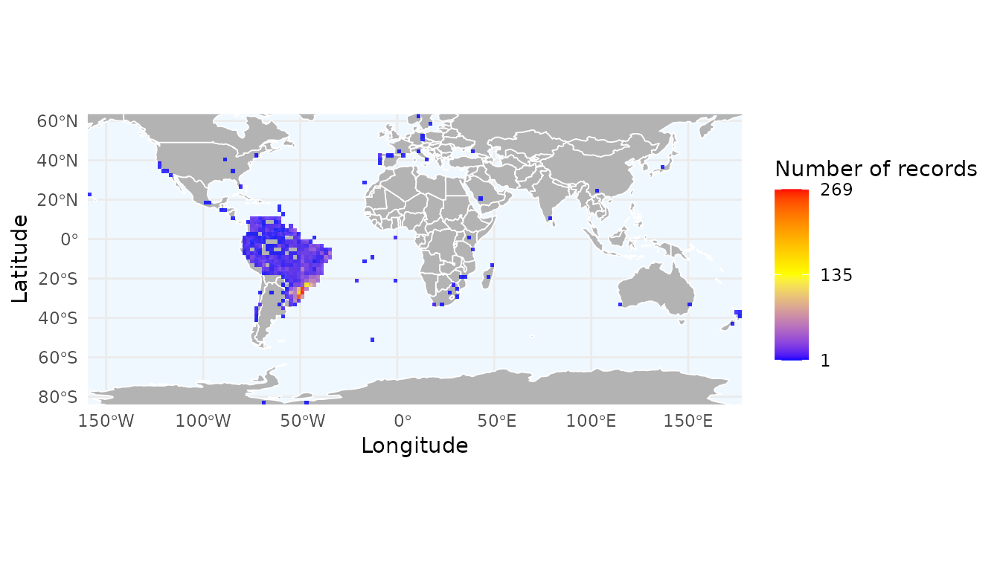
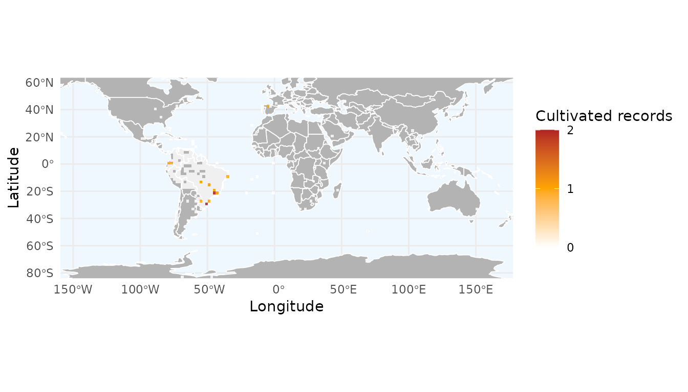

# 3. Flagging Records Using Associated Information

## Introduction

Ensuring data quality is a critical step in biodiversity analysis. This
vignette demonstrates how to clean occurrence records by identifying and
flagging errors derived from record metadata (such as invalid dates,
fossils, or cultivated specimens) and spatial artifacts (such as
coordinates that fall on capitals, biodiversity institutions, or are
geographic outliers).

We will use a combination of *RuHere* functions for flagging metadata
issues and duplicates, and the *CoordinateCleaner* package for
additional spatial tests.

## Proposed workflow

The main idea of the package is to provide full control and
reproducibility over the record-removal process. This is achieved by
creating *flag columns* in the dataset, which are logical variables
indicating whether a record passed a given test (`TRUE`) or failed it
(`FALSE`). This approach allows users to:

- Visuallize and inspect potentially erroneous records interactively
  before deciding whether to remove them.
- Define exceptions; that is, retain records that were flagged or remove
  records that were not flagged.
- Save flagged records to separate files, with information indicating
  why each record was excluded.
- Generate reports summarizing the cleaning process, making it more
  transparent and reproducible.

## Overview of the functions:

- [`remove_invalid_coordinates()`](https://wevertonbio.github.io/RuHere/reference/remove_invalid_coordinates.md):
  removes invalid geographic coordinates.
- [`flag_fossil()`](https://wevertonbio.github.io/RuHere/reference/flag_fossil.md):
  scans description columns for terms like “fossil” or “paleontological”
  to avoid mixing modern distribution data with fossil records.
- [`flag_cultivated()`](https://wevertonbio.github.io/RuHere/reference/flag_cultivated.md):
  identifies specimens from botanical gardens, greenhouses, or
  plantations based on habitat and locality remarks.
- [`flag_inaturalist()`](https://wevertonbio.github.io/RuHere/reference/flag_inaturalist.md):
  specifically targets iNaturalist records. By setting research_grade =
  FALSE, we flag observations that haven’t been peer-verified by the
  community.
- [`flag_year()`](https://wevertonbio.github.io/RuHere/reference/flag_year.md):
  flags records collected outside a plausible time range or those with
  missing dates.
- [`flag_duplicates()`](https://wevertonbio.github.io/RuHere/reference/flag_duplicates.md):
  identifies and flags duplicated records.
- [`remove_flagged()`](https://wevertonbio.github.io/RuHere/reference/remove_flagged.md):
  removes flagged records.

## Getting ready

At this stage, you should have an occurrence dataset that has been
standardized using the
[`format_columns()`](https://wevertonbio.github.io/RuHere/reference/format_columns.md)
function and merged with
[`bind_here()`](https://wevertonbio.github.io/RuHere/reference/bind_here.md).
For additional details on this workflow, see the vignette **“1.
Obtaining and preparing species occurrence data”**. Ideally, these
records should also be standardized for spatial consistency of country
and state information. See the vignette **“2. Ensuring Spatial
Consistency”** for further details.

To illustrate how the function works, we use the example occurrence
dataset included in the package, which contains records for three
species: the Paraná pine (*Araucaria angustifolia*), the azure jay
(*Cyanocorax caeruleus*), and the yellow trumpet tree (*Handroanthus
albus*).

``` r
# Load RuHere
library(RuHere)
# Loading the example data
data("occurrences", package = "RuHere")
```

  

## Removing invalid coordinates (`remove_invalid_coordinates()`)

Before conducting any spatial validation or modeling, it is essential to
ensure the coordinates are valid. The
[`remove_invalid_coordinates()`](https://wevertonbio.github.io/RuHere/reference/remove_invalid_coordinates.md)
function filters out records where coordinates are non-numeric, missing
(`NA`), or fall outside the valid global range (Latitude: -90 to 90;
Longitude: -180 to 180).

By setting `return_invalid = TRUE`, the function returns a list
containing both the clean (`$valid`) and discarded (`$invalid`) records,
which is useful if you want to inspect the records that were removed. We
then update our working dataset (`occ`) to keep only the valid records.

``` r
# Remove invalid coordinates and store the result as a list to separate valid/invalid data
occ_split <- remove_invalid_coordinates(
  occ = occurrences,
  long = "decimalLongitude",
  lat = "decimalLatitude",
  return_invalid = TRUE
)

# Records with invalid coordinates
occ_split$invalid[, c("species", "decimalLongitude", "decimalLatitude")]
#>                         species decimalLongitude decimalLatitude
#> 376      Araucaria angustifolia               NA              NA
#> 3606       Cyanocorax caeruleus               NA              NA
#> 3768 Handroanthus serratifolius               NA              NA

# Update the main 'occ' data frame to contain only the valid records
occ <- occ_split$valid
```

  

## Flagging based on metadata information

After ensuring that the coordinates are valid, the next step is to
assess the quality of the biological and temporal information associated
with each record. Occurrence datasets often contain valuable additional
information describing the conditions under which the occurrence was
recorded. These additional columns are referred to as **metadata**.

`RuHere` provides four specialized functions to identify common
metadata-related issues:

### Fossil records

If the goal is to study the contemporary distribution of a species,
fossil records should be excluded. The
[`flag_fossil()`](https://wevertonbio.github.io/RuHere/reference/flag_fossil.md)
function scans the metadata for terms indicating that a record
corresponds to a fossil.

``` r
occ <- flag_fossil(occ) # Scan for fossil-related terms
# Number of records flagged as fossil
sum(!occ$fossil_flag) # No records flagged as fossil
#> [1] 0
```

  

### Cultivated individuals

For plants, cultivated individuals may represent populations occurring
outside the natural range of the species. The
[`flag_cultivated()`](https://wevertonbio.github.io/RuHere/reference/flag_cultivated.md)
function scans the metadata for terms indicating that a record
corresponds to a cultivated individual. This function is heavily
inspired by the `getCult()` function from the `plantR` package:

``` r
occ <- flag_cultivated(occ) # Scan for fossil-related terms
# Number of records flagged as fossil
sum(!occ$cultivated_flag)
#> [1] 14
```

  

### Records from iNaturalist

Some records, especially in GBIF, are sourced from the citizen science
project [iNaturalist](https://www.inaturalist.org/). Because many of
these occurrences are recorded by non-specialists, you may wish to
exclude them from your analyses. However, a subset of iNaturalist
records is classified as *Research Grade*, indicating a higher level of
confidence in the species identification. The
[`flag_inaturalist()`](https://wevertonbio.github.io/RuHere/reference/flag_inaturalist.md)
function allows you to flag all iNaturalist records or only those that
are not classified as Research Grade:

``` r
# Flag all iNaturalist records (including Research Grade)
occ_inat <- flag_inaturalist(occ, 
                             research_grade = TRUE) #Flag even when is research-grade
sum(!occ_inat$inaturalist_flag) #Number of flagged records
#> [1] 869

# Flag only iNaturalist records without Research Grade
occ <- flag_inaturalist(occ, 
                        research_grade = FALSE) # Flags only non-peer-verified iNaturalist records
sum(!occ$inaturalist_flag) #All inaturalist records are classified as Research Grade
#> [1] 0
```

  

### Records outside a year range

Depending on your objectives, you may wish to exclude records that fall
outside a specific temporal range. For example, when fitting ecological
niche models using climate variables, very old records may represent
populations collected in regions that have since changed and may no
longer be suitable for the species. As an example, we flag records
collected before 1980:

``` r
occ <- flag_year(occ, lower_limit = 1980, 
                 upper_limit = NULL) #We could specify a upper limit as well
sum(!occ$year_flag) #Number of flagged records
#> [1] 198
```

  

## Flagging duplicates

Some records are duplicates, that means, they have the same coordinates.
Some of them are full duplicates, that means, additionaly to have the
same coordinates, they also have the same metadata.

In the example provided in the package, we have been already removed the
duplicated records. But to ilustrate the function, let’s create a new
dataset with the records duplicates:

``` r
# Duplicated records
new_occ <- rbind(occurrences[1:1000, ], occurrences[1:100,])
```

  

RuHere provides several options to deal with duplicates:

- **Flag duplicates based only on coordinates**: for most cases, you may
  wish to keep only one record among the duplicated. By default, the
  kept record is choosen randomly. In RuHere we can control which record
  will be kept. For example, we can keep the most recent and/or
  prioritize records from a specific data_source:

``` r
# Flag records and keep the most recent and preferably from GBIF:
# Create vector to prioritize gbif records
preferable_datasource <- c("gbif", "specieslink", "idigbio")
occ_dup1 <- flag_duplicates(occ = new_occ, continuous_variable = "year",
                            categorical_variable = "data_source", 
                            priority_categories = preferable_datasource)
sum(!occ_dup1$duplicated_flag) #Number of flagged records
#> [1] 100
```

  

- **Flag duplicates based on coordinates and metadata**: in some cases,
  you may wish to consider duplicates only the records that were
  collected in the same place and also in the same time. That means,
  records collected in the same place but in different years were not
  considered duplicates:

``` r
# Flag duplicates based on coordinates and year
occ_dup2 <- flag_duplicates(occ = new_occ, additional_groups = "year")
```

  

- **Flag duplicates based on cells of a raster**: if you have a
  SpatRaster, you can consider as duplicates all the records that falls
  in the same cell.

``` r
# Import raster
data("worldclim", package = "RuHere")
wc <- terra::unwrap(worldclim) #Unpack raster
# Flag duplicates based in raster cells and keep the most recent 
occ_dup3 <- flag_duplicates(occ = new_occ, continuous_variable = "year", 
                            by_cell = TRUE, raster_variable = wc)
```

  

If you are working with a large dataset, we recommend flagging and
removing duplicate records as a first step after data standardization.
More details on how to remove flagged records are provided below.

## Spatial cleaning (`CoordinateCleaner`)

After verifying the metadata, the next step is to address spatial
artifacts. For this stage, we integrate the `CoordinateCleaner` package
into our workflow. This package provides a robust set of ready-to-use
functions that are fully compatible with `RuHere` outputs, allowing for
automated identification of common geographic errors in biodiversity
data.

Spatial artifacts often occur when coordinates are assigned to general
locations, such as a country’s capital, a state center, or a
biodiversity institution, rather than the actual collection site.

### Implement flags from CoordinateCleaner

**CoordinateCleaner** is an R package that performs automated tests to
identify suspicious geographic coordinates. Among its various functions,
it compares occurrence coordinates against reference databases of
country and province centroids, country capitals, urban areas, and
biodiversity institutions. For a comprehensive overview of the available
methods, see the paper linked
[here](https://besjournals.onlinelibrary.wiley.com/doi/10.1111/2041-210X.13152).

**RuHere** is fully compatible with the flags generated by
**CoordinateCleaner**, as both packages add logical flag columns to the
dataset (prefixed with `.`). To apply the desired coordinate checks, you
simply need to use the
[`clean_coordinates()`](https://ropensci.github.io/CoordinateCleaner/reference/clean_coordinates.html)
function:

``` r
# Install the package if necessary
# if(!require("CoordinateCleaner")){
#   install.packages("CoordinateCleaner")
# }

# Loading the package
library(CoordinateCleaner)

# Run spatial check using some tests
occ <- clean_coordinates(x = occ,
                         tests = c("capitals", "centroids", "equal", 
                                   "institutions", "zeros"))
#> Testing coordinate validity
#> Flagged 0 records.
#> Testing equal lat/lon
#> Flagged 3 records.
#> Testing zero coordinates
#> Flagged 6 records.
#> Testing country capitals
#> Flagged 23 records.
#> Testing country centroids
#> Flagged 7 records.
#> Testing biodiversity institutions
#> Flagged 6 records.
#> Flagged 39 of 4077 records, EQ = 0.01.
```

  

The final columns of the occurrence dataset contain the results of the
**CoordinateCleaner** validation. The summary column only reports
whether a record passed all applied tests, and can be ignored for the
purposes of this vignette.

``` r
head(occ[,19:25])
#>   .val .equ .zer .cap .cen .inst .summary
#> 1 TRUE TRUE TRUE TRUE TRUE  TRUE     TRUE
#> 2 TRUE TRUE TRUE TRUE TRUE  TRUE     TRUE
#> 3 TRUE TRUE TRUE TRUE TRUE  TRUE     TRUE
#> 4 TRUE TRUE TRUE TRUE TRUE  TRUE     TRUE
#> 5 TRUE TRUE TRUE TRUE TRUE  TRUE     TRUE
#> 6 TRUE TRUE TRUE TRUE TRUE  TRUE     TRUE
```

  

## Map of occurrence flags

Once records have been flagged, it is highly recommended to visualize
them to assess whether the flagging is accurate before proceeding with
final record removal.

*RuHere* provides two options for mapping flagged records: an
interactive option via
[`map_here()`](https://wevertonbio.github.io/RuHere/reference/map_here.md),
which uses the `mapview` package, and a static option via
[`ggmap_here()`](https://wevertonbio.github.io/RuHere/reference/ggmap_here.md),
which uses `ggplot2`. Let’s see the flagged record of the Paraná Pine:

> **Note:** In this vignette, the map generated with
> [`map_here()`](https://wevertonbio.github.io/RuHere/reference/map_here.md)
> is a static snapshot of the interactive map produced in RStudio.

``` r
# Interactive map with map_here()
map_here(occ, species = "Araucaria angustifolia", label = "record_id", cex = 4)
```

  

``` r
# Static map with ggplot
ggmap_here(occ, species = "Araucaria angustifolia", 
           show_no_flagged = FALSE) # Do not show unflagged records
```

  

With
[`ggmap_here()`](https://wevertonbio.github.io/RuHere/reference/ggmap_here.md),
we can also plot each flag in a separate panel by setting
`facet_wrap = TRUE`:

``` r
ggmap_here(occ, species = "Araucaria angustifolia", 
           facet_wrap = TRUE)
```

  

### Get consensus across multiple flags

We can obtain a consensus across multiple flags. The consensus can be
computed in two ways:

- A record is considered valid (`TRUE`) **only if all specified flags
  are valid** (`TRUE`).
- A record is considered valid (`TRUE`) **if at least one specified flag
  is valid** (`TRUE`).

As an example, we compute a consensus using the *cultivated* and *year*
flags. In this case, cultivated records are flagged as invalid only if
they were also collected before 1980. By default, the function creates a
new column named `"consensus_flag"`, but a custom name can be provided.
Here, we name the new flag as `"old_cultivated"`.

``` r
occ_consensus <- flag_consensus(occ, 
                                flags = c("cultivated", "year"),
                                consensus_rule = "any_true",
                                flag_name = "old_cultivated")

# Records flagged because they are cultivated and collected before 1980
occ_consensus_flagged <- occ_consensus[!occ_consensus$old_cultivated, ]
occ_consensus_flagged[, c("species", "cultivated_flag", "year_flag", "old_cultivated")]
#>                         species cultivated_flag year_flag old_cultivated
#> 1381     Araucaria angustifolia           FALSE     FALSE          FALSE
#> 1388     Araucaria angustifolia           FALSE     FALSE          FALSE
#> 1424     Araucaria angustifolia           FALSE     FALSE          FALSE
#> 4769 Handroanthus serratifolius           FALSE     FALSE          FALSE
```

  

We can visualize this custom flag using
[`map_here()`](https://wevertonbio.github.io/RuHere/reference/map_here.md)
or
[`ggmap_here()`](https://wevertonbio.github.io/RuHere/reference/ggmap_here.md).
Because it is a user-defined flag, it must be specified via the
`additional_flags` and `names_additional_flags` arguments, and a color
must also be provided for plotting:

``` r
ggmap_here(occ_consensus, 
           flags = c("year", "cultivated"),            # Specific flags to show
           additional_flags = "old_cultivated",        # Column name of the custom flag
           names_additional_flags = "Old & cultivated",# Label used in the legend
           col_additional_flags = "red",                # Color for the custom flag
           show_no_flagged = FALSE)                      # Do not show unflagged records
```

  

### Removing flagged records

After flagging potential issues, we can use the
[`remove_flagged()`](https://wevertonbio.github.io/RuHere/reference/remove_flagged.md)
function to clean the dataset. This function is highly flexible,
allowing you to filter records based on the flags generated and also
apply manual overrides using the `force_keep` and `force_remove`
arguments:

- `force_keep`: a vector of record IDs that you want to keep in the
  dataset, even if they were flagged as FALSE by one of the functions.

- `force_remove`: a vector of record IDs that you want to exclude, even
  if they passed all automated tests (flagged as TRUE).

As an example, suppose that the records `"gbif_17175"` and `"gbif_6108"`
are known, valid herbarium specimens that were mistakenly flagged as
cultivated, while `"gbif_5516"` and `"specieslink_1091"` are records you
know to be incorrect but were not captured by any automated flag.

We can also specify a directory in which to save the removed records. In
this example, we use a temporary directory, but in practice you should
define a permanent location:

``` r
# Create directory to save removed records
path_to_save <- file.path(tempdir(), "removed_records")
dir.create(path_to_save)

# Identify records to force keeping and removing
to_keep <- c("gbif_17175", "gbif_6108")
to_remove <- c("gbif_5516", "specieslink_1091")

# Remove flagged records with manual control
# and save removed records to a folder
occ_cleaned <- remove_flagged(occ = occ,
                              flags = "all",  
                              column_id = "record_id",
                              force_keep = to_keep,
                              force_remove = to_remove,
                              save_flagged = TRUE,
                              output_dir = path_to_save)

# Total number of records
nrow(occ)
#> [1] 4077
# Number of valid records
nrow(occ_cleaned)
#> [1] 3837
# Number of records removed
nrow(occ) - nrow(occ_cleaned)
#> [1] 240
```

We can inspect the directory specified in `path_to_save` to see the
files containing the removed records. By default, the files are saved in
GZIP format, which is a compressed format that can be read using
data.table::fread().

``` r
fs::dir_tree(path_to_save)
#> Temp/removed_records
#> ├── Biodiversity Institution.gz
#> ├── Capital centroid.gz
#> ├── Country-Province centroid.gz
#> ├── Cultivated.gz
#> ├── Equal lat-long.gz
#> └── Zero lat-long.gz
```

This approach provides a simple and transparent way to maintain control
over the cleaning process, allowing you to incorporate your expert
knowledge as researcher to complement automated data-quality checks.

### Summarizing flags

After flagging the records, we can create a bar plot summarizing the
number of records flagged by each flagging function:

``` r
flag_summary <- summarize_flags(occ)
```

  

The function returns a `data.frame` summarizing the number of records
per flag and a `ggplot2` object displaying this summary as a bar plot:

``` r
# Data.frame summarizing the number of records per flag
flag_summary$df_summary
#>                        Flag    n
#> 4            Equal lat-long    3
#> 5             Zero lat-long    6
#> 8  Biodiversity Institution    6
#> 7 Country-Province centroid    7
#> 1                Cultivated   14
#> 6          Capital centroid   23
#> 9                     Valid 4025
```

  

``` r
# Bar plot
flag_summary$plot_summary
```



The function can also read flagged occurrence data that were saved when
records were removed. To do so, simply specify the same directory used
in
[`remove_flagged()`](https://wevertonbio.github.io/RuHere/reference/remove_flagged.md):

``` r
# Summarize removed records using saved data
flag_summary_dir <- summarize_flags(flagged_dir = path_to_save, 
                                    show_no_flagged = FALSE, #Do not show unflagged records
                                    fill = "firebrick") # Change color of bars
flag_summary_dir$plot_summary
```

  

Since the output is a `ggplot2` object, it can be saved using
[`ggplot2::ggsave()`](https://ggplot2.tidyverse.org/reference/ggsave.html):

``` r
ggplot2::ggsave(filename = file.path(path_to_save, "Summary.png"), 
                plot = flag_summary_dir$plot_summary, width = 8, height = 5, 
                dpi = 600)
```

  

## Spatial aggregation of records and flags

While visualizing individual points is useful for specific inspections,
aggregating data into spatial grids helps identify broad geographic
patterns, such as “hotspots” of record density or regions with high
concentrations of data quality issues.

### Mapping species richness and record density

By default,
[`richness_here()`](https://wevertonbio.github.io/RuHere/reference/richness_here.md)
calculates the number of unique species per cell. You can also calculate
the total number of records to identify sampling effort. The granularity
of the grid is controlled by the `res` argument, which defines the
spatial resolution in decimal degrees.

``` r
# Create a grid of species richness
r_richness <- richness_here(occ, summary = "species", res = 2)

# Create a grid of record density (total number of occurrences)
r_records <- richness_here(occ, summary = "records", res = 2)

# Plotting the results
ggrid_here(r_richness)
```



``` r

ggrid_here(r_records)
```



### Mapping data quality flags

You can use the `field` argument to summarize specific quality flags. In
this example, we create a density map of records flagged by year. This
helps identify if certain regions have a higher prevalence of cultivated
specimens.

``` r
# Converting flag columns to numeric for plotting
# We invert the logic so that errors (FALSE) become 1 and clean data (TRUE) become 0
occ$year_flag_num <- as.numeric(!occ$year_flag)

# Create the grid 
r_flagged <- richness_here(occ, 
                           summary = "records", 
                           field = "year_flag_num", 
                           fun = mean,
                           res = 2)

# Plot with ggrid_here
ggrid_here(r_flagged, 
           low_color = "white", 
           mid_color = "orange", 
           high_color = "firebrick")
```



The `field` argument is highly flexible. While we used flags here, you
can replace the flag column with any numeric trait (e.g., plant height,
seed mass) or environmental variable. By changing the fun argument to
mean or median, you can easily generate maps of average trait values
across space.

Additionally, if you provide a vector of multiple column names to the
`field` argument,
[`ggrid_here()`](https://wevertonbio.github.io/RuHere/reference/ggrid_here.md)
will automatically generate a multi-panel plot.

In the next vignette, we demonstrate how to use expert-derived
information from other biodiversity databases, such as the IUCN and the
World Checklist of Vascular Plants, to identify records that fall
outside the natural range of a species.
