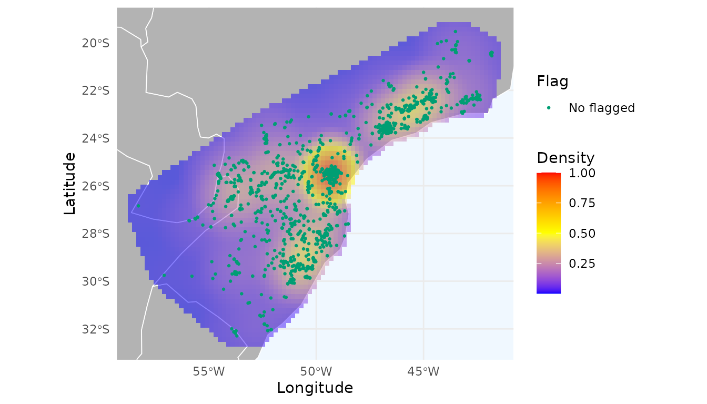
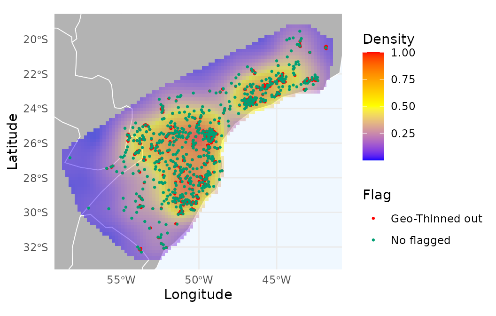
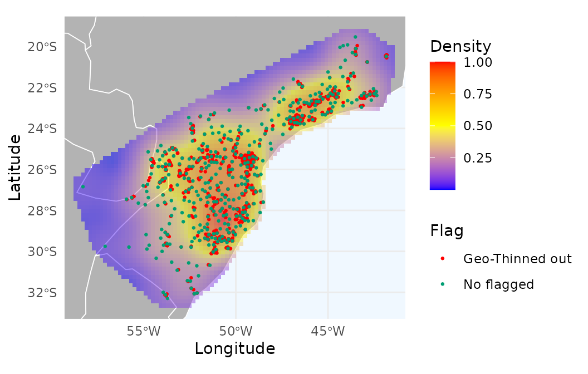
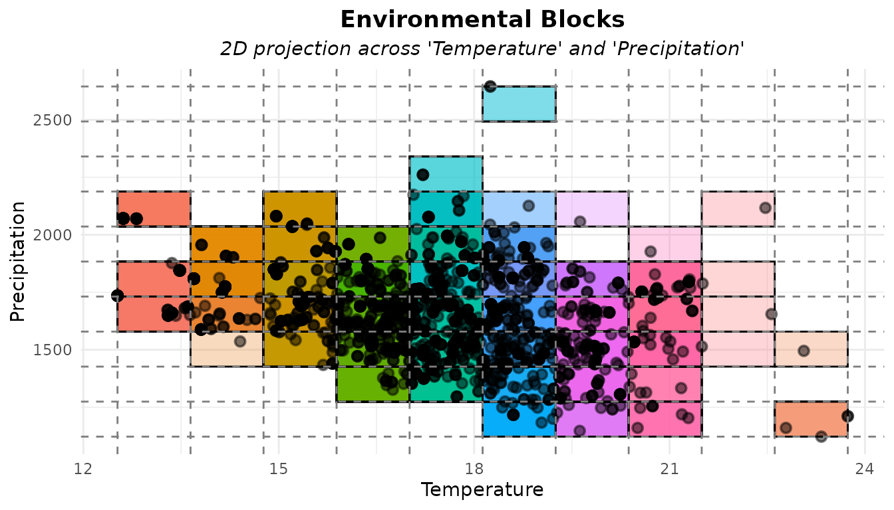
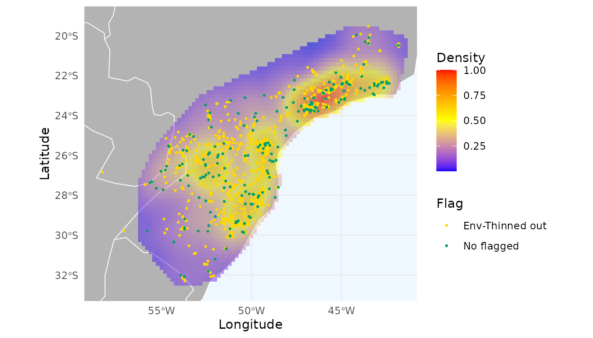
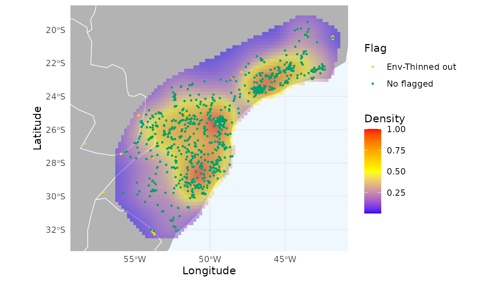
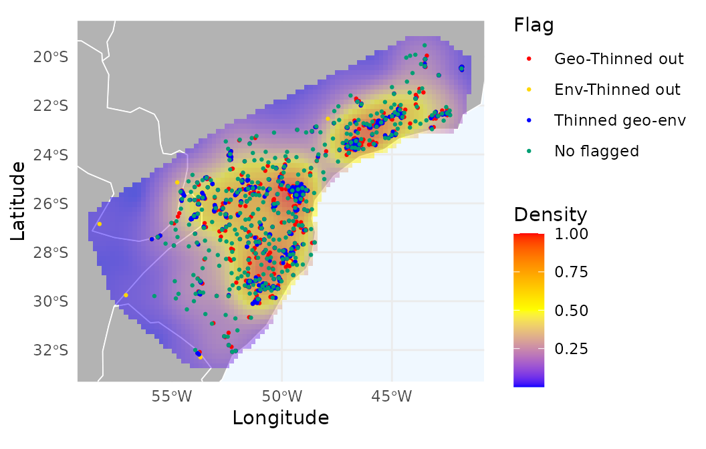

# 5. Reducing sampling bias

## Introduction

For most studies relying on primary biodiversity data, sampling bias can
be a problem because it creates clusters of points that reflect
accessible areas and the preferences of the researchers who collected
the data, rather than the ecological preferences of the species.

Two common approaches to mitigate sampling bias involve thinning
occurrence records (i.e., removing records that are close to each
other). Thinning can be performed in either geographic or environmental
space. The `RuHere` package allows the use of both approaches and also
enables combining the results of both methods.

As an example, let’s use the records of *Araucaria angustifolia*
available in the package, after removing records flagged as potentially
problematic:

``` r
# Load packages
library(RuHere)
library(terra)
#> terra 1.8.93
library(mapview)

# Import occurrence data
data("occ_flagged", package = "RuHere")
# Remove flagged records
occ <- remove_flagged(occ = occ_flagged)
# Plot records
ggmap_here(occ = occ)
```

  

## Heatmap for occurrence data

Before starting the thinning process, let’s create a heatmap based on a
kernel density estimation of the records:

``` r
# Generate heatmap
heatmap <- spatial_kde(occ = occ, resolution = 0.2, buffer_extent = 50,
                       radius = 2, zero_as_NA = TRUE)
```

  

We can use the function
[`ggmap_here()`](https://wevertonbio.github.io/RuHere/reference/ggmap_here.md)
to plot the occurrences and the heatmap (or use
[`map_here()`](https://wevertonbio.github.io/RuHere/reference/map_here.md)
if you prefer an interactive version).

``` r
ggmap_here(occ = occ, size_points = 0.5, heatmap = heatmap)
```

  

We can observe a notable hotspot with a cluster of records around
Curitiba city (capital of Paraná, southern Brazil), which indicates
strong sampling bias. Let’s evaluate the effect of thinning these
records in geographic space.

## Thinning in geographic space

The
[`thin_geo()`](https://wevertonbio.github.io/RuHere/reference/thin_geo.md)
function flags occurrence records for thinning by keeping only one
record per species within a radius of `d` kilometers. This function is
similar to `thin()` from the [spThin
package](https://nsojournals.onlinelibrary.wiley.com/doi/10.1111/ecog.01132),
but with an important difference: it allows specifying a priority order
for retaining records.

When a thinning distance is provided (e.g., 10 km), the function
identifies clusters of records within that distance. Within each
cluster, it retains the record with the highest priority according to
the column defined in prioritary_column (for example, using the most
recent record when `prioritary_column = "year"`), and flags all
remaining nearby records for removal. If `prioritary_column` is `NULL`,
the priority follows the original row order of the input occ data frame.

Let’s thin the records using a 10 km radius and keep the most recent
record as the priority:

``` r
# Thin records using a 10 km distance threshold
occ_thin <- thin_geo(occ = occ, d = 10, prioritary_column = "year")
sum(!occ_thin$thin_geo_flag)  # Number of records flagged for removal
#> [1] 1860
```

  

The function flagged 1,860 records for removal. Let’s visualize the
flagged records using
[`map_here()`](https://wevertonbio.github.io/RuHere/reference/map_here.md)
and create a heatmap with the remaining records.

``` r
# Remove flagged records
occ_thin_geo <- remove_flagged(occ = occ_thin)
# Create heatmap
heatmap_thin_geo <- spatial_kde(occ = occ_thin_geo, resolution = 0.2, 
                                buffer_extent = 50, radius = 2, 
                                zero_as_NA = TRUE)
# Plot
ggmap_here(occ_thin, size_points = 0.5, heatmap = heatmap_thin_geo)
```

  

The thinned dataset (in green) produces a more spatially uniform heatmap
and reduces the strong sampling bias around Curitiba. We explore
different distance thresholds in the next section.

  
\## Selecting the best distance to thin records

A key question is determining the optimal thinning distance, since we
rarely have sufficient biological justification for choosing a specific
value. To address this issue, we adapted the approach of [Velazco et
al. (2020)](https://onlinelibrary.wiley.com/doi/10.1111/ddi.13215),
which computes spatial autocorrelation (Moran’s I) for datasets
generated using different thinning distances and selects the distance
that yields the lowest average spatial autocorrelation.

We extended this procedure by adjusting the selection rules to avoid
choosing datasets with too few records or unrealistically low Moran’s I
values. See
[`help(flag_geo_moran)`](https://wevertonbio.github.io/RuHere/reference/flag_geo_moran.md)
for full details of the selection procedure.

As an example, let’s test the effect of thinning using distances of 1,
3, 5, 7, 10, 15, 20, and 30 km. For computing spatial correlation, we
need a raster containing the environmental variables. Here, we again
specify a priority for retaining records (the most recent ones).

``` r
# Load example of raster variables
data("worldclim", package = "RuHere")
# Unwrap Packed raster
r <- terra::unwrap(worldclim)
# Select thinned occurrences
occ_geo_moran <- flag_geo_moran(occ = occ, 
                                d = c(1, 3, 5, 7, 10, 15, 20, 30), 
                                prioritary_column = "year",
                                env_layers = r)
#> Filtering records...
#> Calculating spatial autocorrelation using Moran Index...
```

  

The results for each tested distance are returned in the `imoran`
data.frame. It includes Moran’s I for each variable and summary
statistics across variables (mean, median, minimum, and maximum), along
with the number of retained records (`n_filtered`) and the proportion of
records flagged (`prop_lost`).

``` r
occ_geo_moran$imoran
#>                   species Distance      bio_1     bio_7    bio_12 median_moran
#> 1  Araucaria angustifolia        1 0.26797715 0.4154464 0.2700062    0.2700062
#> 3  Araucaria angustifolia        3 0.20037829 0.3587940 0.1982657    0.2003783
#> 5  Araucaria angustifolia        5 0.17522297 0.3368257 0.1765754    0.1765754
#> 7  Araucaria angustifolia        7 0.16065669 0.3235316 0.1695589    0.1695589
#> 10 Araucaria angustifolia       10 0.15567148 0.2954804 0.1622244    0.1622244
#> 15 Araucaria angustifolia       15 0.14275985 0.2697169 0.1536365    0.1536365
#> 20 Araucaria angustifolia       20 0.13085143 0.2802101 0.1463788    0.1463788
#> 30 Araucaria angustifolia       30 0.09891003 0.2382515 0.1634006    0.1634006
#>    mean_moran  min_moran max_moran n_filtered all_records prop_lost
#> 1   0.3178099 0.26797715 0.4154464       1236        2426 0.4905194
#> 3   0.2524793 0.19826573 0.3587940        878        2426 0.6380874
#> 5   0.2295414 0.17522297 0.3368257        732        2426 0.6982688
#> 7   0.2179157 0.16065669 0.3235316        634        2426 0.7386645
#> 10  0.2044587 0.15567148 0.2954804        517        2426 0.7868920
#> 15  0.1887044 0.14275985 0.2697169        386        2426 0.8408904
#> 20  0.1858135 0.13085143 0.2802101        313        2426 0.8709810
#> 30  0.1668540 0.09891003 0.2382515        206        2426 0.9150866
```

  

The “best” distance that reduces the spatial autocorrelation without
discarding too many records was 15km. Using this threshold, 2,040
records were flagged.

``` r
# Best distance selected
occ_geo_moran$distance
#> [1] "15"
# Number of flagged records using this distance to thin
sum(!occ_geo_moran$occ$thin_geo_flag)
#> [1] 2040
```

  

Visual inspection shows an even more uniform heatmap:

``` r
# Remove flagged records
occ_thin_geo_moran <- remove_flagged(occ = occ_geo_moran$occ)
# Create heatmap
heatmap_thin_geo_moran <- spatial_kde(occ = occ_thin_geo_moran, 
                                      resolution = 0.2, 
                                      buffer_extent = 50, radius = 2,
                                      zero_as_NA = TRUE)
ggmap_here(occ = occ_geo_moran$occ, size_points = 0.5, 
           heatmap = heatmap_thin_geo_moran)
```

  

A potential issue when filtering records in geographic space is that two
nearby records may actually occur in distinct environmental conditions,
especially in highly heterogeneous regions. This can lead to the loss of
unique information about the species’ niche and environmental
tolerances. To address this, we can instead apply thinning in
environmental space, as explored in the next sections.  

## Thinning in environmental space

Thinning in environmental space removes records with similar
environmental conditions, representing redundant ecological information.
This is achieved by building a multidimensional grid in environmental
space, dividing each variable into `n_bins` equally sized intervals.
Each record is assigned to a unique environmental block (a combination
of bins), and records within the same block (i.e., environmentally
similar) are flagged for removal.

To illustrate how the environmental grid works, let’s use
[`get_env_bins()`](https://wevertonbio.github.io/RuHere/reference/get_env_bins.md)
with 10 bins:

``` r
# Get bins
b <- get_env_bins(occ = occ, env_layers = r, n_bins = 10)
head(b$data)
#>      bio_1  bio_7 bio_12 bio_1_bin bio_7_bin bio_12_bin block_id
#> 1 17.69396 18.667   1523         5         5          3    5_5_3
#> 2 17.10746 17.701   1397         5         4          2    5_4_2
#> 3 16.44496 19.445   1698         4         6          4    4_6_4
#> 4 18.17946 22.320   1872         6         9          5    6_9_5
#> 5 19.71071 18.632   1496         7         5          3    7_5_3
#> 6 17.77913 19.411   1576         5         6          3    5_6_3
```

  

The function returns the environmental block IDs for each record. We can
visualize the grid for any two variables:

``` r
# Plot
plot_env_bins(b, x_var = "bio_1", y_var = "bio_12",
              xlab = "Temperature", ylab = "Precipitation")
```

  

We can see that Several records fall into the same block, meaning they
are environmentally similar and therefore redundant. Let’s flag these
redundant records using
[`thin_env()`](https://wevertonbio.github.io/RuHere/reference/thin_env.md):

``` r
# Flag records that are close to each other in the enviromnetal space
occ_thin_env <- thin_env(occ = occ, env_layers = r, n_bins = 10, 
                         prioritary_column = "year")
# Number of flagged (redundant) records
sum(!occ_thin_env$thin_env_flag) #Number of flagged records
#> [1] 2227
```

  

The function flagged 2,227 records. Let’s visualize these and create a
heatmap of the remaining data.

``` r
# Remove flagged records
occ_thinned_env <- remove_flagged(occ = occ_thin_env)
# Create heatmap
heatmap_thin_env <- spatial_kde(occ = occ_thinned_env, resolution = 0.2, 
                                buffer_extent = 50, radius = 2, 
                                zero_as_NA = TRUE)
ggmap_here(occ_thin_env, size_points = 0.5, heatmap = heatmap_thin_env)
```

  

Thinning in environmental space produces a spatial pattern that differs
from the dataset filtered exclusively in geographic space.

Similar to the thinning process in geographic space, we can test
different numbers of bins (see next section).

## Selecting the best number of environmental bins

In geographic thinning, the key parameter is distance. In environmental
thinning, it is the number of bins. More bins result in finer partitions
of environmental space, reducing the chances of records falling into the
same block. As with geographic thinning, we can test multiple bin values
and select the one that reduces spatial autocorrelation without
discarding many records.

Here, we test 5, 10, 20, 30, 40, 50, 60, 70, and 80 bins:

``` r
# Select thinned occurrences
occ_env_moran <- flag_env_moran(occ = occ, 
                                n_bins = c(5, 10, 20, 30, 40, 50, 60, 70, 80), 
                                prioritary_column = "year",
                                env_layers = r)
#> Filtering records...
#> Calculating spatial autocorrelation using Moran Index...
```

  

Again, results are returned in an imoran data frame. It includes Moran’s
I for each variable and summary statistics across variables (mean,
median, minimum, and maximum), along with the number of retained records
(`n_filtered`) and the proportion of records flagged (`prop_lost`).

``` r
occ_env_moran$imoran
#>                   species n_bins     bio_1     bio_7    bio_12 median_moran
#> 5  Araucaria angustifolia      5 0.2401256 0.3282298 0.1749087    0.2401256
#> 10 Araucaria angustifolia     10 0.2099819 0.3770858 0.1764008    0.2099819
#> 20 Araucaria angustifolia     20 0.1762887 0.3638996 0.1923568    0.1923568
#> 30 Araucaria angustifolia     30 0.1787372 0.3657022 0.1944775    0.1944775
#> 40 Araucaria angustifolia     40 0.1903925 0.3540410 0.1927357    0.1927357
#> 50 Araucaria angustifolia     50 0.1873899 0.3515700 0.1926828    0.1926828
#> 60 Araucaria angustifolia     60 0.1839720 0.3525726 0.1930614    0.1930614
#> 70 Araucaria angustifolia     70 0.1839973 0.3561391 0.1930398    0.1930398
#> 80 Araucaria angustifolia     80 0.1865604 0.3558738 0.1934019    0.1934019
#>    mean_moran min_moran max_moran n_filtered all_records prop_lost
#> 5   0.2477547 0.1749087 0.3282298         57        2426 0.9765045
#> 10  0.2544895 0.1764008 0.3770858        199        2426 0.9179720
#> 20  0.2441817 0.1762887 0.3638996        504        2426 0.7922506
#> 30  0.2463056 0.1787372 0.3657022        658        2426 0.7287716
#> 40  0.2457231 0.1903925 0.3540410        715        2426 0.7052762
#> 50  0.2438809 0.1873899 0.3515700        748        2426 0.6916735
#> 60  0.2432020 0.1839720 0.3525726        757        2426 0.6879637
#> 70  0.2443921 0.1839973 0.3561391        767        2426 0.6838417
#> 80  0.2452787 0.1865604 0.3558738        769        2426 0.6830173
```

  

The “best” number of bins that reduces the spatial autocorrelation
without discarding too many records was 70. With this threshold, 1,659
records were flagged.

``` r
# Best distance selected
occ_env_moran$n_bins
#> [1] "70"
# Number of flagged records using this distance to thin
sum(!occ_env_moran$occ$thin_env_flag)
#> [1] 1659
```

  

Let’s check the distribution of these records and the heatmap generated
with the unflagged records:

``` r
# Remove flagged records
occ_thin_env_moran <- remove_flagged(occ = occ_env_moran$occ)
# Create heatmap
heatmap_thin_env_moran <- spatial_kde(occ = occ_thin_env_moran, 
                                      resolution = 0.2, 
                                      buffer_extent = 50, radius = 2,
                                      zero_as_NA = TRUE)
ggmap_here(occ = occ_env_moran$occ, size_points = 0.5, 
           heatmap = heatmap_thin_env_moran)
```

  

## Consensus between environmental and geographic thinning

Thinning in environmental space can suffer from the opposite issue of
geographic thinning: environmentally similar records may be
geographically far apart, potentially removing important information
about the species’ geographic range.

To address this, the
[`flag_consensus()`](https://wevertonbio.github.io/RuHere/reference/flag_consensus.md)
function can be used to flag records only when they are redundant in
both geographic and environmental space.

``` r
# Flag occurrences by thinning in geographic space
occ_geo_moran <- flag_geo_moran(occ = occ, 
                                d = c(1, 3, 5, 7, 10, 15, 20, 30), 
                                prioritary_column = "year",
                                env_layers = r)
#> Filtering records...
#> Calculating spatial autocorrelation using Moran Index...

# Flag occurrences by thinning in environmental space
occ_env_moran <- flag_env_moran(occ = occ_geo_moran$occ, 
                                n_bins = c(5, 10, 20, 30, 40, 50, 60, 70, 80), 
                                prioritary_column = "year",
                                env_layers = r)
#> Filtering records...
#> Calculating spatial autocorrelation using Moran Index...
# Get consensus
occ_consensus <- flag_consensus(occ = occ_env_moran$occ,
                                flags = c("thin_geo", "thin_env"),
                                consensus_rule = "any_true",
                                flag_name = "thin_geo_env_flag")
# Remove flagged
occ_consensus_filtered <- remove_flagged(occ = occ_consensus, flags = NULL,
                                         additional_flags = c("thin_geo_env" = "thin_geo_env_flag"))

# Create heatmap
heatmap_consensus_filtered <- spatial_kde(occ = occ_consensus_filtered,
                                          resolution = 0.2,
                                          buffer_extent = 50,
                                          radius = 2, zero_as_NA = TRUE)
```

  

Let’s visualize which records were flagged by geographic thinning,
environmental thinning, or both:

``` r
ggmap_here(occ = occ_consensus, 
          flags = c("thin_geo", "thin_env"), 
          additional_flags = "thin_geo_env_flag", 
          names_additional_flags = "Thinned geo-env", 
          col_additional_flags = "blue",
          size_points = 0.5,
          heatmap = heatmap_consensus_filtered)
```

  

Red points indicate records thinned in geographic space; yellow points
indicate thinning in environmental space; and blue points indicate
records thinned in both.

Note that we retained the records flagged only in the geographic
thinning, those flagged only in the environmental thinning, and those
not flagged by either method.
