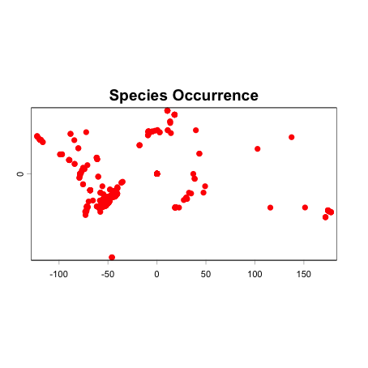

```{r, include = FALSE}
knitr::opts_chunk$set(
  collapse = TRUE,
  comment = "#>",
  eval = F,
  warning = FALSE
)
```

## Introduction

Species occurrence records are the foundation of biodiversity studies. However, working with multiple data sources (such as GBIF, SpeciesLink, BIEN, and iDigBio) presents two major challenges: data acquisition and format standardization. Each database uses different column names and structures, creating a potential problem for researchers.

Here, we will use the species *Araucaria angustifolia*, also known as the Brazilian Pine. It is an emblematic coniferous tree native to the subtropical highlands of Brazil, Argentina, and Paraguay. Due to historical overexploitation and severe habitat loss, this species is currently classified as Critically Endangered (CR) by the IUCN Red List. Its conservation status makes accurate and comprehensive occurrence data crucial for ecological modeling, understanding population decline, and guiding reforestation efforts.

This vignette demonstrates how to configure access credentials, download occurrence data from multiple sources, standardize and unify the results, and finally convert them into spatial objects ready for ecological analysis.

```{r, eval = T}
# Load RuHere package
library(RuHere)
```

## Overview of the functions:
+ `set_specieslink_credentials()`: stores your SpeciesLink API key in the R environment.
+ `set_gbif_credentials()`: stores your GBIF credentials (username, email, and password) in the R environment.
+ `get_specieslink()`: retrieves occurrence data from the SpeciesLink network using user-defined filters.
+ `prepare_gbif_download()`: prepares the query data required for a robust GBIF download request.
+ `request_gbif()`: submits an asynchronous request to download occurrence data from GBIF.
+ `import_gbif()`: imports the dataset that has been processed and downloaded from GBIF using the request key generated by `request_gbif()`.
+ `get_bien()`: downloads occurrence records from the Botanical Information and Ecology Network (BIEN) database.
+ `get_idigbio()`: downloads species occurrence records from the iDigBio (Integrated Digitized Biocollections) database.
+ `format_columns()`: formats and standardizes column names and data types of an occurrence dataset using a built-in template or a custom metadata object.
+ `create_metadata()`: creates a custom metadata template that maps the column names of an external (non-standard) dataset to the package's required standardized schema.
+ `bind_here()`: combines multiple standardized occurrence data frames into a single dataset.
+ `spatialize()`: converts the unified occurrence data frame into a SpatVector object.

## Setting up credentials

Some databases require authentication to access their API. It is recommended to configure this before starting your downloads.

### GBIF

To perform downloads from GBIF using the asynchronous API, you must store your credentials (username, email, and password) in the R environment.

```{r}
set_gbif_credentials(
  gbif_username = "your_username",
  gbif_email = "your_email@domain.com",
  gbif_password = "your_password"
)
#> GBIF credentials have been processed and added/updated in your .Renviron file
#> Check your .Renviron with file.edit('/Users/your_user/.Renviron')
```

### SpeciesLink

To retrieve records from the SpeciesLink network, an API key is required.

```{r}
# You can check your API key at: https://specieslink.net/aut/profile/apikeys
set_specieslink_credentials(specieslink_key = "your_api_key")
#> speciesLink credentials have been processed and added/updated in your .Renviron file
#> Check your .Renviron with file.edit('/Users/your_user/.Renviron')
```

> Note: Only GBIF and SpeciesLink require credentials to be configured beforehand. The BIEN and iDigBio databases do not require API authentication for retrieving occurrence data.

## Data acquisition

We will download occurrence data for *Araucaria angustifolia* as example. First, we define a directory to save the files.

```{r}
# Storing the downloads in a temporary directory
output_dir <- file.path(tempdir(), "occ_data")
dir.create(output_dir)
```

### SpeciesLink, BIEN, and iDigBio

These databases allow direct downloading through a single function call.

```{r}
# SpeciesLink: Filtering by Species
occ_sl <- get_specieslink(
  species = "Araucaria angustifolia",
  dir = output_dir,
  save = FALSE # Doesn't save the results to a file
)
#> Making request to speciesLink...
#> Warning message:
#> In get_specieslink(key = "your_api_key", species = "Araucaria angustifolia",  :
#>   Please make sure that the restrictions and citation indicated by
#>   each speciesLink/CRIA data provider are observed and respected.

# BIEN: Natives only, excluding cultivated records
occ_bien <- get_bien(
  species = "Araucaria angustifolia",
  cultivated = FALSE,
  natives.only = TRUE,
  dir = output_dir
)
#> Getting page 1 of records

# iDigBio: Limiting records for this example
occ_idig <- get_idigbio(
  species = "Araucaria angustifolia",
  limit = 100,
  dir = output_dir
)
```

### GBIF

To ensure access to large datasets, the GBIF download process is split into three steps: prepare, request, and import.

```{r}
# Prepare the taxonomic query
gbif_prep <- prepare_gbif_download(species = "Araucaria angustifolia")
#>   |++++++++++++++++++++++++++++++++++++++++++++++++++| 100% elapsed=02s 
  
# Submit the request to GBIF
gbif_req <- request_gbif(
  gbif_info = gbif_prep,
  hasCoordinate = TRUE,      # Retrieve only records with coordinates
  hasGeospatialIssue = FALSE # Exclude records with geospatial issues
)

# Wait for GBIF processing (you can use rgbif::occ_download_wait(gbif_req))

# Import the processed file
occ_gbif <- import_gbif(
  request_key = gbif_req,
  write_file = FALSE
)
#> Download file size: 2.04 MB
#> On disk at /private/var/folders/7r/k2q5s4110l17txfjdlxwsctm0000gn/T/RtmplcyEvG/0038993-251120083545085.zip
```

## Standardization and unification

At this stage, we have four objects (`occ_sl`, `occ_bien`, `occ_idig`, `occ_gbif`), each with different column names (e.g., `decimalLongitude` vs. `longitude` vs. `long`). The `format_columns()` function resolves this by applying metadata templates.

### Standardizing columns (`format_columns`)

We apply the function to each dataset, specifying the source in the `metadata` argument. This standardizes names, extracts clean binomials, and fixes data types.

```{r}
# Standardizing GBIF
gbif_std <- format_columns(occ_gbif, metadata = "gbif")

# Standardizing SpeciesLink (checking for encoding issues)
sl_std <- format_columns(occ_sl, metadata = "specieslink", check_encoding = TRUE)
#> Warning: NAs introduced by coercion> 

# Standardizing BIEN
bien_std <- format_columns(occ_bien, metadata = "bien")

# Standardizing iDigBio
idig_std <- format_columns(occ_idig, metadata = "idigbio")
```

### Customizing Metadata (`create_metadata`)

The functions above automatically standardize your data because the package contains internal metadata templates ("presets") for GBIF, SpeciesLink, BIEN, and iDigBio. However, if you import occurrence data from an external source (e.g., a local CSV file) with different column names, you must first create a metadata template using `create_metadata()`. This maps your original column names to the package's standardized schema.

The following example demonstrates how to handle occurrence data from an external source (a dataset from the `atlanticr` R package) that does not follow the package's standard column names.

```{r, eval = T}
# Occurrences of Puma concolor from the atlanticr R package
data("puma_atlanticr", package = "RuHere")

# Create metadata to standardize the occurrences
puma_metadata <- create_metadata(occ = puma_atlanticr,
                                 scientificName = "actual_species_name",
                                 decimalLongitude = "longitude",
                                 decimalLatitude = "latitude",
                                 elevation = "altitude",
                                 country = "country",
                                 stateProvince = "state",
                                 municipality = "municipality",
                                 locality = "study_location",
                                 year = "year_finish",
                                 habitat = "vegetation_type",
                                 datasetName = "reference")

# Now, we can use this metadata to standardize the columns
puma_occ <- format_columns(occ = puma_atlanticr, metadata = puma_metadata,
                           binomial_from = "actual_species_name",
                           data_source = "atlanticr")
#> Warning: NAs introduced by coercion

head(puma_occ[, 1:5])
```

### Merging datasets (`bind_here`)

With standardized columns, we can merge everything into a single data frame using $\text{bind\_here()}$.

```{r}
# Merging all datasets (including the external one)
# fill = TRUE ensures that unique columns from one source are filled with NA in others
all_data <- bind_here(gbif_std, sl_std, bien_std, idig_std, fill = TRUE)

head(all_data[, 1:4])
#>   record_id                species                          scientificName collectionCode
#> 1    gbif_1 Araucaria angustifolia Araucaria angustifolia (Bertol.) Kuntze        ALTA-VP
#> 2    gbif_2 Araucaria angustifolia Araucaria angustifolia (Bertol.) Kuntze   Observations
#> 3    gbif_3 Araucaria angustifolia Araucaria angustifolia (Bertol.) Kuntze   Observations
#> 4    gbif_4 Araucaria angustifolia Araucaria angustifolia (Bertol.) Kuntze   Observations
#> 5    gbif_5 Araucaria angustifolia Araucaria angustifolia (Bertol.) Kuntze   Observations
#> 6    gbif_6 Araucaria angustifolia Araucaria angustifolia (Bertol.) Kuntze            HCF
```

The result is a robust dataset containing essential standardized columns such as scientificName, decimalLongitude, decimalLatitude, and year.

## Spatialization (`spatialize`)

To visualize the data on a map or perform geospatial operations, we convert the data frame into a `SpatVector` object.

```{r}
# Convert to spatial object
occ_spatial <- spatialize(
  occ = all_data, 
  long = "decimalLongitude",
  lat = "decimalLatitude",
  crs = "epsg:4326" # WGS84
) # The function automatically ensures coordinates are numeric (`force_numeric = TRUE`)

# Plot the distribution
terra::plot(occ_spatial, col = "red", main = "Species Occurrence")
```

```{r IMG01, eval=T, echo=F, fig.align='center', out.width='80%'}

```
