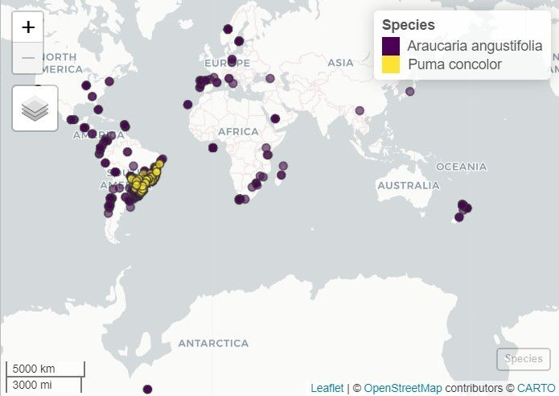

```{r, include = FALSE}
knitr::opts_chunk$set(
  collapse = TRUE,
  comment = "#>",
  eval = F,
  warning = FALSE
)
```

## Introduction

Species occurrence records are the foundation of biodiversity studies. However, working with multiple data sources (such as GBIF, SpeciesLink, BIEN, and iDigBio) presents two major challenges: data acquisition and format standardization. Each database uses different column names and structures, creating a potential problem for researchers.

Here, we will use as example the species *Araucaria angustifolia*, also known as the Paraná Pine. It is an emblematic coniferous tree native to the subtropical highlands of Brazil, Argentina, and Paraguay. Due to historical overexploitation and severe habitat loss, this species is currently classified as Critically Endangered (CR) by the IUCN Red List. Its conservation status makes accurate and comprehensive occurrence data crucial for ecological modeling, understanding population decline, and guiding reforestation efforts.

```{r, eval=T, echo=F, fig.align='center', out.width='80%', fig.cap="Araucaria forest in southern Brazil"}
knitr::include_graphics("vignettes_img/paranapine2.jpeg")
```

This vignette demonstrates how to configure access credentials, download occurrence data from multiple sources, standardize and unify the results, and finally convert them into spatial objects ready for ecological analysis.

```{r, eval = T}
# Load RuHere package
library(RuHere)
```

## Overview of the functions:
+ `set_specieslink_credentials()`: stores your SpeciesLink API key in the R environment.
+ `set_gbif_credentials()`: stores your GBIF credentials (username, email, and password) in the R environment.
+ `get_specieslink()`: retrieves occurrence data from the SpeciesLink network using user-defined filters.
+ `prepare_gbif_download()`: prepares the query data required for a robust GBIF download request.
+ `request_gbif()`: submits an asynchronous request to download occurrence data from GBIF.
+ `import_gbif()`: imports the dataset that has been processed and downloaded from GBIF using the request key generated by `request_gbif()`.
+ `get_bien()`: downloads occurrence records from the Botanical Information and Ecology Network (BIEN) database.
+ `get_idigbio()`: downloads species occurrence records from the iDigBio (Integrated Digitized Biocollections) database.
+ `format_columns()`: formats and standardizes column names and data types of an occurrence dataset using a built-in template or a custom metadata object.
+ `create_metadata()`: creates a custom metadata template that maps the column names of an external (non-standard) dataset to the package's required standardized schema.
+ `bind_here()`: combines multiple standardized occurrence data frames into a single dataset.
+ `spatialize()`: converts the unified occurrence data frame into a SpatVector object.

## Setting up credentials

Some databases require authentication to access their API. It is recommended to configure this before starting your downloads.

### GBIF

To download data from [GBIF](https://www.gbif.org/) using the asynchronous API, you must have an account an store your credentials (username, email, and password) in your R environment. You can find your GBIF username and the e-mail address associated with your account on the GBIF website ([https://www.gbif.org/user/profile](https://www.gbif.org/user/profile)).

```{r}
set_gbif_credentials(
  gbif_username = "your_username",
  gbif_email = "your_email@domain.com",
  gbif_password = "your_password",
  verbose = FALSE
)
```

### SpeciesLink

To retrieve records from the SpeciesLink network, an API key is required. You can create and check your API key at: [https://specieslink.net/aut/profile/apikeys](https://specieslink.net/aut/profile/apikeys).

```{r}
set_specieslink_credentials(specieslink_key = "your_api_key", verbose = FALSE)
```

> Note: Only GBIF and SpeciesLink require credentials to be configured beforehand. The BIEN and iDigBio databases do not require API authentication for retrieving occurrence data.

## Data acquisition

We will download occurrence data for *Araucaria angustifolia* as an example. 

### GBIF

To ensure access to large datasets, the GBIF download process is split into three steps: prepare, request, and import.

To download record from GBIF, we need to define a directory to save the files.

```{r}
# Store downloads in a temporary directory
# In your own project, replace this with a permanent directory
output_dir <- file.path(tempdir(), "occ_data")
dir.create(output_dir)
```

```{r}
# Prepare the taxonomic query
gbif_prep <- prepare_gbif_download(species = "Araucaria angustifolia")
```

The function returns a `data.frame` containing information about the species in GBIF, including the total number of records, the number of records with geographic coordinates (longitude and latitude), the GBIF key (ID), and the taxonomic classification.

```{r}
gbif_prep
#> with_coordinates n_records                species usageKey                          scientificName          canonicalName
#> 1             3056     15696 Araucaria angustifolia  2684940 Araucaria angustifolia (Bertol.) Kuntze Araucaria angustifolia
#>     rank   status confidence matchType kingdom       phylum   order        family     genus kingdomKey phylumKey classKey
#> 1 SPECIES ACCEPTED         97     EXACT Plantae Tracheophyta Pinales Araucariaceae Araucaria          6   7707728      194
#>   orderKey familyKey genusKey speciesKey     class          verbatim_name
#> 1      640      3924  2684910    2684940 Pinopsida Araucaria angustifolia
```

After confirming that the information is correct and that this is indeed the species for which we want to download records, we can use this object to request a download from GBIF. By default, the function retrieves only records with geographic coordinates and without spatial issues, but this can be modified. 

The function also supports more complex download requests by allowing predicates to be passed via the `additional_predicates` argument. See `help(rgbif::pred)` for more details.

```{r}
# Submit the request to GBIF
gbif_req <- request_gbif(
  gbif_info = gbif_prep,
  hasCoordinate = TRUE,      # Retrieve only records with coordinates
  hasGeospatialIssue = FALSE # Exclude records with geospatial issues
)
```

The request is processed by GBIF and may take several minutes to complete (usually less than 15 minutes, but potentially several hours depending on the number of occurrences). You can check the status of the download using the `rgbif` package. Once the process is complete, the following message is returned:

```{r}
rgbif::occ_download_wait(gbif_req)
#> status: succeeded
#> download is done, status: succeeded
```

Now we can download the occurrence records and import them into R:

```{r}
# Import the processed file
occ_gbif <- import_gbif(request_key = gbif_req)
#> Download file size: 2.04 MB
```

By default, the function imports the dataset with only the 25 columns required by the other functions in the package. This behavior can be changed by setting `select_columns = FALSE` or by explicitly specifying the columns to import via the `columns_to_import` argument.

```{r}
head(occ_gbif)
#> # A tibble: 6 × 25
#>   scientificName                acceptedScientificName occurrenceID collectionCode catalogNumber decimalLongitude #> decimalLatitude
#>   <chr>                         <chr>                  <chr>        <chr>          <chr>                    <dbl>           #> <dbl>
#> 1 Araucaria angustifolia (Bert… Araucaria angustifoli… urn:catalog… ALTA-VP        74703                    -52.8          #> -26.4 
#> 2 Araucaria angustifolia (Bert… Araucaria angustifoli… https://www… Observations   329390275                -49.2          #> -25.4 
#> 3 Araucaria angustifolia (Bert… Araucaria angustifoli… https://www… Observations   329483122                -49.5          #> -28.0 
#> 4 Araucaria angustifolia (Bert… Araucaria angustifoli… https://www… Observations   329455309                -74.0            #> 4.68
#> 5 Araucaria angustifolia (Bert… Araucaria angustifoli… https://www… Observations   329576016                -45.6          #> -22.7 
#> 6 Araucaria angustifolia (Bert… Araucaria angustifoli… https://www… Observations   329805643                175.           #> -39.9 
#> # ℹ 18 more variables: coordinateUncertaintyInMeters <dbl>, elevation <dbl>, continent <chr>, countryCode <chr>,
#> #   stateProvince <chr>, municipality <chr>, locality <chr>, verbatimLocality <chr>, year <int>, eventDate <chr>,
#> #   recordedBy <chr>, identifiedBy <chr>, basisOfRecord <chr>, occurrenceRemarks <chr>, habitat <chr>, datasetName <chr>,
#> #   datasetKey <chr>, speciesKey <int>
```

### SpeciesLink, BIEN, and iDigBio

GBIF is the most used database for obtaining occurrence records. However, unique records can be found in other databases. In the RuHere package, we implement functions for downloading records from 3 other databases:

 - SpeciesLink: a large-scale biodiversity information portal created in Brazil. Most of the records found in [SpeciesLink](https://specieslink.net/) are also found in GBIF, but it also provide unique records.
 - BIEN: occurrence records cleaned and standardized by the [Botanical Information and Ecology Network](https://bien.nceas.ucsb.edu/bien/).
 - iDigBio: occurrence records cleaned and standardized by the [Integrated Digitized Biocollections project](https://www.idigbio.org/).

These databases allow direct downloading through a single function call. 

```{r}
# SpeciesLink: Filtering by Species
occ_sl <- get_specieslink(species = "Araucaria angustifolia", verbose = FALSE)

# BIEN: Natives only, excluding cultivated records
occ_bien <- get_bien(species = "Araucaria angustifolia",
                     cultivated = FALSE,
                     natives.only = TRUE,
                     verbose = FALSE)
#> Getting page 1 of records

# iDigBio: 
occ_idig <- get_idigbio(species = "Araucaria angustifolia")
```

## Standardization and unification

At this stage, we have four occurrence datasets (`occ_gbif`, `occ_sl`, `occ_bien`, and `occ_idig`). We can merge these datasets using the bind_here() function. However, we get an error if we try to merge the raw datasets:

```{r}
all_occ <- bind_here(occ_gbif, occ_sl, occ_bien, occ_idig)
#> Error: All datasets must have the same columns.
```

This occurs because each data source may provide datasets with different column names (e.g., `decimalLongitude` vs. `longitude` vs. `long`). Another common issue involves column classes. For instance, date-related fields (such as collection dates) may be stored as character vectors, numeric values, or objects of class `Date`. Special characters can also cause problems, as datasets with different text encodings may fail to bind correctly.

All of these issues can be addressed using the `format_columns()` function. This function applies metadata templates to standardize column names and data types, ensuring that all datasets are consistent and can be safely combined.

### Standardizing columns (`format_columns`)

We apply the function to each dataset, specifying the source in the `metadata` argument. This standardizes column names, extracts clean binomials, and fixes data types.

```{r}
# Standardizing GBIF
gbif_std <- format_columns(occ_gbif, metadata = "gbif")

# Standardizing SpeciesLink (checking for encoding issues)
sl_std <- format_columns(occ_sl, metadata = "specieslink", check_encoding = TRUE)
#> Warning: NAs introduced by coercion> 

# Standardizing BIEN
bien_std <- format_columns(occ_bien, metadata = "bien")

# Standardizing iDigBio
idig_std <- format_columns(occ_idig, metadata = "idigbio")
```

You may sometimes encounter the warning `“NAs introduced by coercion”`. This occurs when a column that is expected to store numeric values (for example, a year) contains data of another class (such as character strings) that cannot be converted to numeric. In such cases, the incompatible values are replaced with `NA`.

Now, we can safelly bind the occurrences:

```{r}
all_occ <- bind_here(gbif_std, sl_std, bien_std, idig_std)
# Number of records by database
table(all_occ$data_source)
#>       bien        gbif     idigbio specieslink 
#>        137        3000        1271        1224 
```

### Customizing Metadata (`create_metadata`)

The functions above automatically standardize your data because the package contains internal metadata templates ("presets") for GBIF, SpeciesLink, BIEN, and iDigBio. However, if you import occurrence data from an external source (e.g., a local CSV file) with different column names, you must first create a metadata template using `create_metadata()`. This maps your original column names to the package's standardized schema.

The following example demonstrates how to handle data from an external source, using occurrences of cougar (*Puma concolor*) originally from the `atlanticr` R package (which is included in `RuHere` for demonstration purposes).

In summary, the arguments must be filled with the names of the columns in the occurrence dataset that are equivalent to the expected fields. For example, in the example dataset, the `scientificName` is stored in the `"actual_species_name"` column, and the coordinates are stored in the `"longitude"` and `"latitude"` columns. These three columns are the only mandatory ones, but we strongly recommend providing as many additional columns as possible in order to take full advantage of the other functions in the package.

```{r, eval = TRUE}
# Import data example
data("puma_atlanticr", package = "RuHere")

# Create metadata to standardize the occurrences
puma_metadata <- create_metadata(occ = puma_atlanticr,
                                 scientificName = "actual_species_name",
                                 decimalLongitude = "longitude",
                                 decimalLatitude = "latitude",
                                 elevation = "altitude",
                                 country = "country",
                                 stateProvince = "state",
                                 municipality = "municipality",
                                 locality = "study_location",
                                 year = "year_finish",
                                 habitat = "vegetation_type",
                                 datasetName = "reference")

# Now, we can use this metadata to standardize the columns
puma_occ <- format_columns(occ = puma_atlanticr, metadata = puma_metadata,
                           binomial_from = "actual_species_name",
                           data_source = "atlanticr")

head(puma_occ[, 1:5])
```

Even though this is an occurrence dataset from a different species, we can merge the cougar occurrences with those of Araucaria:

```{r}
occ_araucaria_cougar <- bind_here(all_occ, #Occurrences of Araucaria
                                  puma_occ) #Occurrences of cougar
# Number of records per species
table(occ_araucaria_cougar$species)
#> Araucaria angustifolia          Puma concolor 
#>                  5632                    139 
```

The result is a robust dataset containing essential standardized columns such as species, decimalLongitude, decimalLatitude, and year.

## Spatialization (`spatialize`)

To visualize the data on a map or perform geospatial operations, we can convert the data frame into a `SpatVector` object. This object can be plotted using the **terra** package (`terra::plot`) or displayed in an interactive map using the **mapview** package:

```{r}
# Convert to spatial object
occ_spatial <- spatialize(occ = occ_araucaria_cougar)

# Load mapview
library(mapview)

# Plot the distribution using mapview
mapview(occ_spatial, zcol = "species", layer.name = "Species", cex = 4)
```

```{r IMG01, eval=T, echo=F, fig.align='center', out.width='80%'}

```
